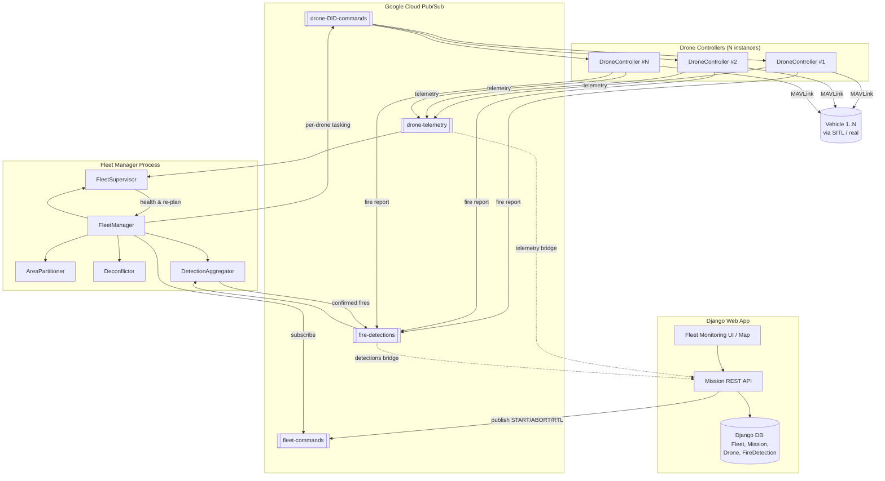
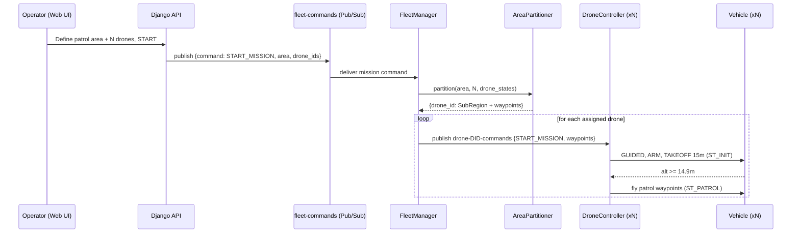
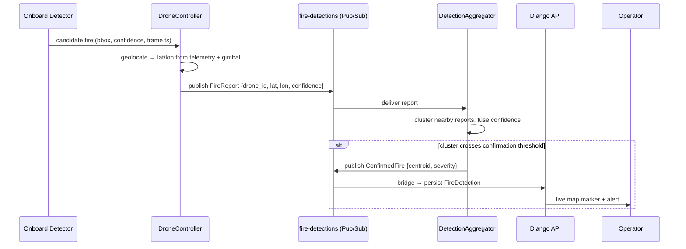
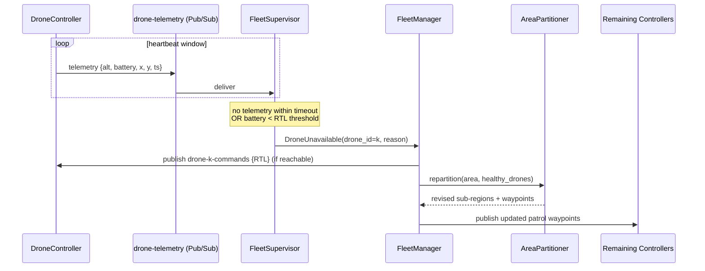

# Design Document: Swarm Drone Patrol

## Overview

This feature scales the existing single-drone architecture into coordinated **swarm / multi-drone operations** that patrol a user-specified geographic area to detect forest fires. A new **Fleet Manager** layer sits above `DroneController`: it decomposes the patrol area into per-drone sub-regions, launches and supervises N drone controller instances, deconflicts their flight paths, aggregates fire-detection reports, and re-plans coverage when a drone is lost, low on battery, or out of comms.

The design deliberately reuses the established building blocks rather than replacing them:

- The per-drone **state machine** (`ST_IDLE → ST_INIT → ST_MOVE → ST_SURVEY → ST_RETURN / ST_SAFETY_LAND`) from `drone_controller.py` remains the unit of work. It is extended with a lawnmower/waypoint patrol capability and a fire-detection reporting hook, but its transition contract is preserved.
- **MAVLink** (`pymavlink.mavutil`) stays the drone-control transport. Each controller owns one MAVLink connection to one vehicle (distinct system IDs / connection strings).
- **Google Cloud Pub/Sub** stays the command and telemetry bus, extended from a single shared topic to a **per-drone topic namespace** plus fleet-wide broadcast and aggregation topics.
- The **Django web app** (`Drone`, `UserProfile`, `FavoriteDrone` models; map view; `track_drones`) is extended with fleet, mission, and fire-detection models so the existing map/monitoring UI can render live swarm state instead of stubbed sample data.

The result is a layered system where the Fleet Manager is a coordinator of many nearly-unchanged single-drone controllers, communicating over the same Pub/Sub fabric the web app already speaks.

## Architecture



**Layering summary:**

| Layer | Responsibility | Reuses |
|-------|----------------|--------|
| Django Web App | Operator input, mission lifecycle UI, live map, fire alerts | Existing models, map view, `track_drones` |
| Pub/Sub Bus | Async command/telemetry/detection transport | Existing `drone-commands-sub` pattern |
| Fleet Manager | Area decomposition, tasking, deconfliction, aggregation, supervision | New |
| Drone Controllers | Per-vehicle flight execution (state machine) | Existing `DroneController` |

## Sequence Diagrams

### Mission start: operator to airborne swarm



### Fire detection: from onboard detector to confirmed alert



### Drone loss: supervision and coverage re-plan



## Components and Interfaces

### Component 1: FleetManager

**Purpose**: Top-level orchestrator. Owns the mission lifecycle, holds the fleet roster, and coordinates partitioning, tasking, deconfliction, aggregation, and supervision.

**Interface**:
```python
class FleetManager:
    def __init__(self, project_id: str, fleet_config: "FleetConfig"): ...

    async def start_mission(self, area: "PatrolArea", drone_ids: list[str]) -> "MissionPlan":
        """Partition area, task each drone, and begin supervision."""

    async def abort_mission(self, reason: str) -> None:
        """Broadcast ABORT/RTL to all drones and tear down the mission."""

    async def handle_drone_unavailable(self, drone_id: str, reason: str) -> "MissionPlan":
        """Remove a drone from the active roster and re-plan coverage."""

    async def run(self) -> None:
        """Main loop: subscribe to fleet-commands + telemetry; drive supervision."""
```

**Responsibilities**:
- Translate operator commands (from `fleet-commands`) into per-drone tasking.
- Maintain authoritative `MissionPlan` (which drone owns which sub-region).
- React to `FleetSupervisor` health events by re-planning.

### Component 2: AreaPartitioner

**Purpose**: Decompose a patrol polygon into N contiguous, load-balanced sub-regions and produce a coverage (lawnmower) waypoint path per sub-region.

**Interface**:
```python
class AreaPartitioner:
    def partition(self, area: "PatrolArea", drones: list["DroneState"]) -> dict[str, "SubRegion"]:
        """Return drone_id -> SubRegion. Balances area by drone endurance/battery."""

    def coverage_path(self, region: "SubRegion", sweep_spacing_m: float,
                      altitude_m: float) -> list["Waypoint"]:
        """Generate a boustrophedon (lawnmower) sweep covering the region."""
```

**Responsibilities**:
- Ensure sub-regions are collectively exhaustive and pairwise non-overlapping (see Correctness Properties).
- Weight partition size by each drone's available battery/endurance.

### Component 3: Deconflictor

**Purpose**: Prevent inter-drone collisions by assigning separated altitude bands and/or time-phased entry, and by validating that planned paths respect minimum separation.

**Interface**:
```python
class Deconflictor:
    def assign_altitudes(self, plan: "MissionPlan") -> dict[str, float]:
        """Assign a distinct altitude band per drone within safe AGL limits."""

    def check_separation(self, telemetry: dict[str, "DroneState"]) -> list["Conflict"]:
        """Return pairs violating horizontal+vertical minimum separation."""
```

**Responsibilities**:
- Guarantee any two active drones are separated horizontally OR vertically by the configured minima.
- Surface live conflicts to the FleetManager for evasive tasking.

### Component 4: DetectionAggregator

**Purpose**: Consume raw `FireReport`s from all drones, cluster spatially-close reports, fuse confidence, and emit `ConfirmedFire` events once a cluster crosses a confirmation threshold.

**Interface**:
```python
class DetectionAggregator:
    def ingest(self, report: "FireReport") -> "ConfirmedFire | None":
        """Add a report to spatial clusters; return a confirmation if triggered."""

    def active_fires(self) -> list["ConfirmedFire"]:
        """Current confirmed fires with fused location and severity."""
```

**Responsibilities**:
- Deduplicate multiple drones reporting the same fire.
- Only escalate to a confirmed alert when spatial/confidence thresholds are met.

### Component 5: FleetSupervisor

**Purpose**: Watch per-drone telemetry heartbeats and health (battery, comms, altitude) and raise availability events.

**Interface**:
```python
class FleetSupervisor:
    def record_telemetry(self, drone_id: str, telemetry: dict) -> None:
        """Update last-seen timestamp and health snapshot for a drone."""

    def evaluate(self, now: float) -> list["HealthEvent"]:
        """Return events: comms-loss (timeout), low-battery, geofence breach."""
```

**Responsibilities**:
- Detect comms loss via heartbeat timeout.
- Detect battery below the RTL threshold before it becomes a safety landing.

### Component 6: DroneController (extended)

**Purpose**: The existing per-vehicle state machine, extended for patrol and fire reporting. **The existing transition contract and MAVLink helpers are preserved.**

**Interface** (additions in **bold**):
```python
class DroneController:
    # existing: connect_mavlink, send_command, send_movement_command,
    #           set_mode, transition, handle_init, monitor_telemetry,
    #           pubsub_callback, listen_pubsub

    drone_id: str                      # NEW: identity within the fleet
    patrol_waypoints: list["Waypoint"] # NEW: assigned coverage path
    patrol_index: int                  # NEW: current leg

    async def transition(self, next_state: str) -> None:
        """Extended with ST_PATROL handling; existing states unchanged."""

    def report_fire(self, detection: "FireCandidate") -> None:   # NEW
        """Geolocate a candidate and publish a FireReport to fire-detections."""

    def publish_telemetry(self) -> None:                          # NEW
        """Publish current telemetry to drone-telemetry topic."""
```

**Responsibilities**:
- Execute an assigned waypoint patrol (new `ST_PATROL` state) instead of only the fixed single-target survey.
- Publish telemetry and fire reports to Pub/Sub so the Fleet Manager and web app can observe it.

## Data Models

### Model 1: PatrolArea

```python
@dataclass
class GeoPoint:
    lat: float   # degrees, [-90, 90]
    lon: float   # degrees, [-180, 180]

@dataclass
class PatrolArea:
    polygon: list[GeoPoint]   # ordered vertices of the patrol boundary
    home: GeoPoint            # launch/return point
```

**Validation Rules**:
- `polygon` has at least 3 vertices and is non-self-intersecting.
- All lat/lon within valid ranges; `home` inside or adjacent to the polygon.

### Model 2: DroneState

```python
@dataclass
class DroneState:
    drone_id: str
    battery: int               # percent, [0, 100]
    endurance_s: float         # estimated remaining flight seconds
    position: GeoPoint | None  # last known
    altitude_m: float
    online: bool
    last_seen_ts: float
```

**Validation Rules**:
- `battery` in `[0, 100]`; `endurance_s >= 0`.
- `online` is `False` when `now - last_seen_ts > comms_timeout_s`.

### Model 3: SubRegion / Waypoint

```python
@dataclass
class Waypoint:
    lat: float
    lon: float
    altitude_m: float

@dataclass
class SubRegion:
    drone_id: str
    polygon: list[GeoPoint]
    waypoints: list[Waypoint]
    altitude_band_m: float
```

**Validation Rules**:
- `altitude_band_m` distinct per drone (deconfliction).
- `waypoints` cover `polygon` at the configured sweep spacing.

### Model 4: FireReport / ConfirmedFire

```python
@dataclass
class FireReport:
    drone_id: str
    location: GeoPoint
    confidence: float   # [0.0, 1.0]
    timestamp: float

@dataclass
class ConfirmedFire:
    fire_id: str
    centroid: GeoPoint
    severity: float        # fused confidence/size score
    contributing_reports: int
    first_seen_ts: float
```

**Validation Rules**:
- `confidence` in `[0.0, 1.0]`.
- `ConfirmedFire` emitted only when `contributing_reports >= min_reports` OR fused confidence `>= confirm_threshold`.

### Model 5: MissionPlan

```python
@dataclass
class MissionPlan:
    mission_id: str
    area: PatrolArea
    assignments: dict[str, SubRegion]   # drone_id -> region
    status: str                         # PLANNED | ACTIVE | REPLANNING | ABORTED | DONE
```

**Validation Rules**:
- Union of all `assignments[*].polygon` covers `area.polygon` (completeness).
- Assignment polygons are pairwise non-overlapping (exclusivity).

### Django models (web-app integration)

Extends `drones/models.py`. `Drone` gains a stable `drone_id` and live fields; new `Fleet`, `Mission`, and `FireDetection` models back the monitoring UI.

```python
class Fleet(models.Model):
    name = models.CharField(max_length=255)
    owner = models.ForeignKey(User, on_delete=models.CASCADE)

class Mission(models.Model):
    fleet = models.ForeignKey(Fleet, on_delete=models.CASCADE)
    area_geojson = models.TextField()          # PatrolArea polygon
    status = models.CharField(max_length=32)    # mirrors MissionPlan.status
    started_at = models.DateTimeField(null=True)

# Drone extended: + drone_id (unique), + fleet FK, + latitude/longitude/altitude,
#                 + online (bool), + last_seen (datetime)

class FireDetection(models.Model):
    mission = models.ForeignKey(Mission, on_delete=models.CASCADE)
    latitude = models.FloatField()
    longitude = models.FloatField()
    severity = models.FloatField()
    confirmed = models.BooleanField(default=False)
    detected_at = models.DateTimeField(auto_now_add=True)
```

## Algorithmic Pseudocode

### Area partitioning (balanced strip decomposition)

```pascal
ALGORITHM partition(area, drones)
INPUT:  area (PatrolArea), drones (list of DroneState, all online)
OUTPUT: assignments (map drone_id -> SubRegion)

BEGIN
  ASSERT len(drones) >= 1
  ASSERT polygon_valid(area.polygon)

  // Weight each drone by its remaining endurance so stronger drones cover more.
  total_endurance <- SUM(d.endurance_s FOR d IN drones)
  ASSERT total_endurance > 0

  // Split the area's bounding extent into vertical strips proportional to weight.
  (min_x, max_x) <- longitude_extent(area.polygon)
  cursor <- min_x
  assignments <- {}

  FOR each d IN drones ORDERED BY drone_id DO
    ASSERT invariant_no_overlap(assignments)   // loop invariant

    fraction <- d.endurance_s / total_endurance
    strip_width <- (max_x - min_x) * fraction
    strip <- clip_polygon(area.polygon, cursor, cursor + strip_width)

    region <- SubRegion(
        drone_id = d.drone_id,
        polygon  = strip,
        waypoints = coverage_path(strip, SWEEP_SPACING_M, BASE_ALT_M),
        altitude_band_m = BASE_ALT_M   // refined later by Deconflictor
    )
    assignments[d.drone_id] <- region
    cursor <- cursor + strip_width
  END FOR

  ASSERT union_covers(assignments, area.polygon)   // completeness
  ASSERT invariant_no_overlap(assignments)         // exclusivity
  RETURN assignments
END
```

**Preconditions**: at least one online drone; `area.polygon` is a valid simple polygon; total endurance > 0.
**Postconditions**: every drone gets a `SubRegion`; regions collectively cover the area and are pairwise non-overlapping.
**Loop Invariants**: after processing each drone, no two assigned strips overlap, and assigned strips are contiguous from `min_x` to `cursor`.

### Coverage path (boustrophedon / lawnmower sweep)

```pascal
ALGORITHM coverage_path(region_polygon, spacing, altitude)
INPUT:  region_polygon, spacing (meters between sweep lines), altitude
OUTPUT: waypoints (ordered list of Waypoint)

BEGIN
  ASSERT spacing > 0
  (min_y, max_y) <- latitude_extent(region_polygon)
  waypoints <- []
  y <- min_y
  direction <- +1   // alternate sweep direction each line

  WHILE y <= max_y DO
    line_segment <- intersect_horizontal(region_polygon, y)
    IF line_segment is non-empty THEN
      endpoints <- order(line_segment.start, line_segment.end, direction)
      APPEND Waypoint(endpoints.first, altitude) TO waypoints
      APPEND Waypoint(endpoints.last,  altitude) TO waypoints
      direction <- -direction   // boustrophedon reversal
    END IF
    y <- y + meters_to_degrees_lat(spacing)
  END WHILE

  ASSERT every_point_within(region_polygon) covered within spacing/2
  RETURN waypoints
END
```

**Preconditions**: `spacing > 0`; `region_polygon` valid.
**Postconditions**: waypoints trace a continuous serpentine path whose swaths (width = spacing) cover the region.
**Loop Invariants**: all sweep lines with latitude < `y` have already been appended in alternating order.

### Fire-report aggregation (spatial clustering + confirmation)

```pascal
ALGORITHM ingest(report, clusters)
INPUT:  report (FireReport), clusters (list of Cluster, mutable)
OUTPUT: ConfirmedFire OR null

BEGIN
  ASSERT 0.0 <= report.confidence <= 1.0

  matched <- null
  FOR each c IN clusters DO
    IF haversine(c.centroid, report.location) <= CLUSTER_RADIUS_M THEN
      matched <- c
      BREAK
    END IF
  END FOR

  IF matched = null THEN
    matched <- new Cluster(centroid = report.location, reports = [])
    APPEND matched TO clusters
  END IF

  APPEND report TO matched.reports
  matched.centroid <- weighted_mean(matched.reports)      // fuse location
  fused_conf <- noisy_or(r.confidence FOR r IN matched.reports)

  IF NOT matched.confirmed AND
     (len(matched.reports) >= MIN_REPORTS OR fused_conf >= CONFIRM_THRESHOLD) THEN
    matched.confirmed <- true
    RETURN ConfirmedFire(
        fire_id = new_id(),
        centroid = matched.centroid,
        severity = fused_conf,
        contributing_reports = len(matched.reports),
        first_seen_ts = MIN(r.timestamp FOR r IN matched.reports))
  END IF

  RETURN null   // no new confirmation
END
```

**Preconditions**: `report.confidence` in `[0,1]`.
**Postconditions**: the report is assigned to exactly one cluster; a `ConfirmedFire` is returned at most once per cluster (on the transition to confirmed).
**Loop Invariants**: `matched` is the first cluster within `CLUSTER_RADIUS_M` of the report, or remains null if none exists.

### Supervision & re-plan trigger

```pascal
ALGORITHM evaluate(now, drone_states)
INPUT:  now (timestamp), drone_states (map drone_id -> DroneState)
OUTPUT: events (list of HealthEvent)

BEGIN
  events <- []
  FOR each d IN drone_states.values() DO
    IF now - d.last_seen_ts > COMMS_TIMEOUT_S THEN
      APPEND HealthEvent(d.drone_id, "COMMS_LOSS") TO events
    ELSE IF d.battery <= RTL_BATTERY_PCT THEN
      APPEND HealthEvent(d.drone_id, "LOW_BATTERY") TO events
    END IF
  END FOR
  RETURN events
END
```

**Preconditions**: `drone_states` reflects the latest telemetry ingested.
**Postconditions**: one event per unhealthy drone; healthy drones produce no event.
**Loop Invariants**: `events` contains findings only for drones examined so far.

## Key Functions with Formal Specifications

### FleetManager.start_mission()

```python
async def start_mission(self, area: PatrolArea, drone_ids: list[str]) -> MissionPlan
```

**Preconditions**:
- `area` is a valid `PatrolArea` (polygon with ≥3 vertices, valid coords).
- `drone_ids` is non-empty and all referenced drones are online.

**Postconditions**:
- Returns a `MissionPlan` with `status == "ACTIVE"`.
- Every online drone in `drone_ids` has a `SubRegion` assignment.
- A per-drone `START_MISSION` command with waypoints has been published to each `drone-{id}-commands` topic.
- Assignments satisfy coverage completeness and exclusivity.

**Loop Invariants**: N/A at this level (delegates loop to `AreaPartitioner`).

### Deconflictor.assign_altitudes()

```python
def assign_altitudes(self, plan: MissionPlan) -> dict[str, float]
```

**Preconditions**:
- `plan.assignments` is non-empty.
- `MIN_ALT_M`, `MAX_ALT_M`, `ALT_BAND_GAP_M` configured with room for `len(assignments)` bands.

**Postconditions**:
- Returns one altitude per drone within `[MIN_ALT_M, MAX_ALT_M]`.
- Any two returned altitudes differ by at least `ALT_BAND_GAP_M`.

**Loop Invariants**: assigned altitudes so far are pairwise separated by ≥ `ALT_BAND_GAP_M`.

### DroneController.transition() — ST_PATROL extension

```python
async def transition(self, next_state: str) -> None
```

**Preconditions**:
- `next_state` is a valid state token.
- For `ST_PATROL`: `self.patrol_waypoints` is non-empty and MAVLink is connected/armed.

**Postconditions**:
- `self.state == next_state`.
- For `ST_PATROL`: a `set_position_target_local_ned` (or waypoint) command toward `patrol_waypoints[patrol_index]` has been sent.
- Existing states (`ST_INIT`, `ST_MOVE`, `ST_SURVEY`, `ST_RETURN`, `ST_SAFETY_LAND`) behave exactly as before.

**Loop Invariants**: patrol progression maintains `0 <= patrol_index <= len(patrol_waypoints)`.

## Example Usage

```python
# --- Operator side (invoked by Django API when START is pressed) ---
area = PatrolArea(
    polygon=[GeoPoint(37.40, -122.10), GeoPoint(37.40, -122.05),
             GeoPoint(37.44, -122.05), GeoPoint(37.44, -122.10)],
    home=GeoPoint(37.40, -122.10),
)
publisher.publish("fleet-commands", json.dumps({
    "command": "START_MISSION",
    "area": area_to_geojson(area),
    "drone_ids": ["drone-01", "drone-02", "drone-03"],
}).encode())

# --- Fleet Manager side ---
async def main():
    fm = FleetManager(project_id=PROJECT_ID, fleet_config=load_fleet_config())
    await fm.run()   # subscribes to fleet-commands + drone-telemetry, drives supervision

# On START_MISSION, FleetManager internally does:
plan = await fm.start_mission(area, drone_ids)
#   -> AreaPartitioner.partition(area, online_drones)
#   -> Deconflictor.assign_altitudes(plan)
#   -> publish per-drone START_MISSION + waypoints

# --- Drone Controller side (extended, per vehicle) ---
# Receives START_MISSION with waypoints on drone-01-commands, runs:
#   ST_INIT (arm + takeoff)  ->  ST_PATROL (fly assigned lawnmower path)
# During ST_PATROL, on a detector hit:
ctrl.report_fire(FireCandidate(confidence=0.82, bbox=..., frame_ts=...))
#   -> geolocate -> publish FireReport to fire-detections

# --- Aggregator side ---
confirmed = aggregator.ingest(FireReport(
    drone_id="drone-02", location=GeoPoint(37.42, -122.07),
    confidence=0.82, timestamp=time.time()))
if confirmed:
    publisher.publish("fire-detections", confirmed_to_json(confirmed))
    # -> bridged into Django FireDetection -> live map marker + operator alert
```

## Correctness Properties

### Property 1: Coverage completeness
For all valid `PatrolArea` and non-empty online `drones`, `partition` produces assignments whose union of polygons covers the entire area — ∀ point p ∈ area.polygon, ∃ drone_id such that p ∈ assignments[drone_id].polygon.

### Property 2: Assignment exclusivity
For all partition outputs, any two distinct assignments have non-overlapping interiors — ∀ i≠j, interior(region_i) ∩ interior(region_j) = ∅.

### Property 3: Altitude separation
For all mission plans, `assign_altitudes` yields altitudes where ∀ i≠j, |alt_i − alt_j| ≥ ALT_BAND_GAP_M, keeping any co-located drones vertically deconflicted.

### Property 4: Path coverage
For all valid regions and `spacing > 0`, every point in the region lies within `spacing/2` of some sweep line in the generated `coverage_path`.

### Property 5: Confirmation idempotence
For all report sequences, `DetectionAggregator` emits at most one `ConfirmedFire` per spatial cluster (the confirmation transition is monotonic).

### Property 6: Report clustering soundness
For all reports, a report joins a cluster iff it is within `CLUSTER_RADIUS_M` of that cluster's centroid; otherwise it seeds a new cluster.

### Property 7: Supervision liveness
For all drones, if `now − last_seen_ts > COMMS_TIMEOUT_S` then `evaluate` returns a `COMMS_LOSS` event for that drone (no unhealthy drone is silently ignored).

### Property 8: Re-plan invariance
After `handle_drone_unavailable`, the revised `MissionPlan` still satisfies coverage completeness and exclusivity over the healthy drone set.

### Property 9: State-machine compatibility
For all existing command tokens, the extended `DroneController` produces the same transitions as the original single-drone controller (no regression for `START_MISSION`, `ABORT`, `RTL`, `SURVEY`).

## Error Handling

### Comms loss with a drone
**Condition**: No telemetry from a drone for `COMMS_TIMEOUT_S`.
**Response**: `FleetSupervisor` raises `COMMS_LOSS`; `FleetManager` marks the drone offline, attempts an RTL command (best-effort), and re-partitions among remaining drones.
**Recovery**: If the drone reconnects, it re-registers via telemetry and can be folded back in on the next re-plan.

### Low battery before task completion
**Condition**: Drone battery ≤ `RTL_BATTERY_PCT`.
**Response**: `LOW_BATTERY` event; FleetManager sends `RTL` to that drone and re-plans its uncovered sub-region among the rest.
**Recovery**: Drone returns to launch under the existing `ST_RETURN` logic; its region is absorbed by peers.

### Inter-drone separation conflict
**Condition**: `Deconflictor.check_separation` finds a pair below horizontal AND vertical minima.
**Response**: FleetManager commands one drone to hold or shift to its assigned altitude band; conflicting waypoints are re-sequenced.
**Recovery**: Once separation is restored, normal patrol resumes.

### Invalid patrol area from operator
**Condition**: Polygon with <3 vertices, self-intersecting, or out-of-range coordinates.
**Response**: Django API rejects the request with a validation error before publishing to `fleet-commands`.
**Recovery**: Operator corrects the area; nothing is dispatched to the fleet.

### Duplicate / conflicting fire reports
**Condition**: Multiple drones report the same fire, or spurious single-drone reports.
**Response**: `DetectionAggregator` clusters spatially and only confirms on threshold, suppressing duplicates and low-confidence noise.
**Recovery**: Unconfirmed clusters age out after an inactivity window.

### MAVLink / vehicle failure during flight
**Condition**: MAVLink connection drops or arming/takeoff fails (existing `connect_mavlink` / `handle_init` paths).
**Response**: Controller logs the error; absence of telemetry propagates to the supervisor as comms loss (handled above). Critical failures trigger `ST_SAFETY_LAND`.
**Recovery**: FleetManager re-plans around the lost vehicle.

## Testing Strategy

### Unit Testing Approach
- `AreaPartitioner`: coverage completeness and exclusivity on convex and concave polygons; single-drone and N-drone cases; endurance-weighted split sizes.
- `coverage_path`: swath coverage within `spacing/2`; boustrophedon direction alternation.
- `Deconflictor.assign_altitudes`: pairwise separation ≥ gap; failure when insufficient band room.
- `DetectionAggregator.ingest`: clustering radius behavior; single confirmation per cluster; noisy-OR fusion.
- `FleetSupervisor.evaluate`: comms-timeout and low-battery thresholds; healthy drones produce no events.
- `DroneController`: `ST_PATROL` waypoint progression; regression tests proving existing state transitions are unchanged.

### Property-Based Testing Approach
Generate random valid polygons + random drone rosters and assert the coverage/exclusivity/altitude/confirmation properties from the Correctness Properties section hold across many cases.

**Property Test Library**: Hypothesis (Python).

### Integration Testing Approach
Extend the existing SITL harness (`run_controller_sim.py`) to launch **multiple** SITL instances on distinct ports (e.g., `udp:127.0.0.1:14552`, `:14562`, ...), spin up a FleetManager against a Pub/Sub emulator, dispatch a mission, and assert each simulated drone flies its assigned sub-region and that injected fire reports surface as confirmed detections in the web app.

## Performance Considerations
- Telemetry publish rate per drone should be throttled (e.g., 1–2 Hz to Pub/Sub) while the controller's internal `monitor_telemetry` loop keeps running at ~10 Hz for local control, decoupling flight control latency from bus load.
- Partitioning and re-planning are O(N) in drones and O(V) in polygon vertices — cheap relative to flight timescales; re-plan is triggered by events, not polled.
- Aggregator clustering is O(reports × clusters); bounded by capping active clusters and aging out stale ones.

## Security Considerations
- Per-drone command topics (`drone-{id}-commands`) should use Pub/Sub IAM so a compromised drone identity cannot command peers.
- The Django API must authenticate operators (existing `User`/`UserProfile`) before publishing mission commands, and validate the patrol area server-side.
- MAVLink links should be restricted to the local/simulation network; production deployments should add link-level auth/encryption where the transport supports it.

## Dependencies
- Existing: `pymavlink` (MAVLink control), `google-cloud-pubsub` (command/telemetry bus), Django (web app), ArduPilot SITL (simulation), NGINX-RTMP (existing camera streaming).
- New: `shapely` (polygon clipping / coverage geometry) or an equivalent geometry helper; `hypothesis` (property-based tests); a fire-detection model/service feeding `FireCandidate`s to controllers (out of scope for coordination logic, consumed via `report_fire`).
